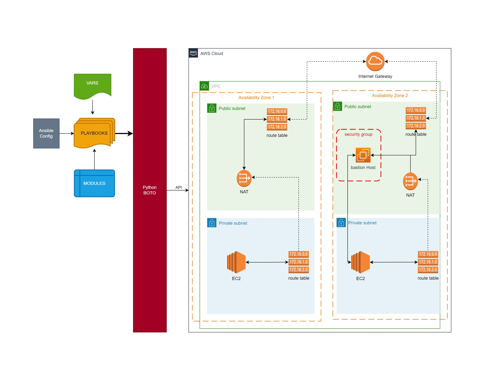

# Ansible-VPC

## Cloud Automation with Ansible 
This repository focuses on automating the setup of a 
**Virtual Private Cloud (VPC)** on AWS using Ansible.
Efficiently deploying a secure and highly available 
VPC architecture with ease.

### Project Goals:
The primary objectives of this project are as follows:
- **Cloud Automation:** Utilize Ansible, a powerful automation tool, to streamline the process of setting up a VPC infrastructure on AWS.
- **Security and High Availability:** Implement best practices for security and high availability within the VPC environment.
- **Comprehensive Configuration:** Cover all crucial aspects, including subnets, NAT gateways, internet gateways, route tables, security groups, instances, elastic IPs, and the integration of a bastion host (jump server).
- **Change Management:** Implement centralized change management to easily accommodate future modifications and updates to the VPC setup.
- **Infrastructure as Code (IaaC):** Use version control to maintain the VPC setup as code, ensuring consistency and traceability.

## Architecture Overview
Here's an overview of the architecture you'll be implementing through this project:


## Tools and Services Used
Key tools and services involved in this project include:

- EC2: Elastic Compute Cloud instances for deploying and managing infrastructure.
- Ansible: Automation tool used for configuration management.
- GitHub: Version control to track and manage changes to infrastructure code.


## Learning Objectives
- Setting up infrastructure using Ansible.
- Creating a secure environment.
- Using variable files for defining VPC and bastion host configuration.
- Writing Ansible playbooks for VPC and bastion host setup.

## Implementation

1. **Launch EC2 Instance**: 
control-machine for running ansible playbook, pre-installed with Ansible and Boto
2. **Create and attach IAM Role for Instance**
3. **Create Variable files for VPC & Bastion host**
4. **Create VPC & Bastion host setup playbooks**

## Prerequisites:
- An active AWS account to provision resources.
- Basic familiarity with AWS services and concepts.

## Detailed Steps
### 1.  Setup EC2 Instance

- Name: **`control-machine`**
- Project: `Ansible-VPC`
- AMI: `Ubuntu Server 22.04 LTS`
- type: `t2.micro`
- Key pair: `ansible-ohio-key`
- Network settings: Security group: **ansible-SG**
  - Inbound rules: SSH (Port 22) from **MY IP**
- Advanced details (User data) : 
```bash
    #!/bin/bash
    sudo apt update
    sudo apt install ansible -y
    sudo apt install awscli -y
    sudo apt install python3-boto3 -y
```

### 2. **Create and attach IAM Role**
with administrator policy and assign role to EC2 Instance

test by running:
``` 
aws sts get-caller-identity
```

### 3. Create Variable Files: 
- [vpc_setup](vars/vpc_setup): Define variables related to VPC configuration.
- [bastion_setup](vars/bastion_setup): Define variables for bastion host setup.

### 4. Create VPC & Bastion host setup playbooks

- [vpc_setup.yml](./vpc-setup.yml): VPC setup playbook.
- [bastion-instance.yml](./bastion-instance.yml): bastion host setup playbook.


### References and Documentation: 
[Modules on Ansible website](https://docs.ansible.com/ansible/2.9/modules/modules_by_category.html)


 