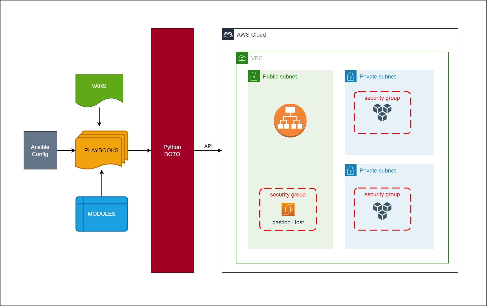

# Ansible-VPC

## Cloud Automation with Ansible 
Automating the Deployment of a Secure and Highly Available **Virtual Private Cloud (VPC)** on AWS using Ansible.

### Project Goals:
The primary objectives of this project are as follows:
- **Cloud Automation:** Utilize Ansible, a powerful automation tool, to streamline the process of setting up a VPC infrastructure on AWS.
- **Security and High Availability:** Implement best practices for security and high availability within the VPC environment.
- **Comprehensive Configuration:** Cover all crucial aspects, including subnets, NAT gateways, internet gateways, route tables, security groups, instances, elastic IPs, and the integration of a bastion host (jump server).
- **Change Management:** Implement centralized change management to easily accommodate future modifications and updates to the VPC setup.
- **Infrastructure as Code (IaaC):** Use version control to maintain the VPC setup as code, ensuring consistency and traceability.

## Architecture Overview
The architecture consists of the following components:
- VPC
- IAM Roles
- Subnets
- Internet Gateway
- NAT Gateways
- Route Tables
- Security Groups
- EC2 Instances (including Bastion Host)



## Tools and Services Used
Key tools and services involved in this project include:

- EC2: Elastic Compute Cloud instances for deploying and managing infrastructure.
- Ansible: Automation tool used for configuration management.
- GitHub: Version control to track and manage changes to infrastructure code.

## Learning Objectives
1. **Infrastructure as Code (IaaC):** Understand the concept for improved manageability.
2. **Ansible Playbooks:** writing Ansible playbooks for setting up complex components, enhancing automation skills.
3. **AWS Resource Provisioning:** provisioning AWS resources programmatically.
4. **Security Best Practices**  within a VPC, setting up security groups, private and public subnets, and a bastion host.
5. **High Availability:** multi-availability-zone deployment and the creation of redundant resources.
6. **Variable Usage:** using variables effectively in Ansible playbooks for dynamic configuration and maintainability.
7. **Troubleshooting and Debugging:** using tools for diagnosing issues and debugging automation scripts.


## Implementation Steps

1. **Launch EC2 Instance**: 
control-machine for running ansible playbook, pre-installed with Ansible and Boto
2. **Create and attach IAM Role for Instance**
3. **Create Variable files for VPC & Bastion host**
4. **Create VPC & Bastion host setup playbooks**
5. **Run playbooks**

## Prerequisites:
- An active AWS account to provision resources.
- Basic familiarity with AWS services and concepts.

## Detailed Steps
### 1.  Setup EC2 Instance

- Name: **`control-machine`**
- Project: `Ansible-VPC`
- AMI: `Ubuntu Server 22.04 LTS`
- type: `t2.micro`
- Key pair: `ansible-ohio-key`
- Network settings: Security group: **ansible-SG**
  - Inbound rules: SSH (Port 22) from **MY IP**
- Advanced details (User data) : 
```bash
#!/bin/bash
sudo apt update
sudo apt install ansible -y
sudo apt install awscli -y
  sudo apt install python3-boto3 python3-botocore python3-boto -y
```

### 2. **Create and attach IAM Role**
with administrator policy and assign role to EC2 Instance

test by running:
``` 
aws sts get-caller-identity
```

### 3. Create Variable Files: 

- [vpc_setup](vars/vpc_setup): Define variables related to VPC configuration.
  - VPC Range, Subnet Range, Region, availability zones, and state 
  - Define variables for bastion host setup.
  - bastion ami, region and IP 

### 4. Create VPC setup playbook

[vpc_setup.yml](./vpc-setup.yml): VPC setup playbook
- Imports `vars/vpc_setup` file
- Creates VPC
- Creates Public Subnets in different AZs
- Creates Internet Gateway
- Creates Public subnet route tables
- Creates a new NAT gateway and allocate Elastic IP
- Creates Private subnet route tables
- The created resources and their IDs are written to an `output_vars` file for further usage.

### 5. Create Bastion host setup playbook

- [bastion-instance.yml](./bastion-instance.yml): bastion host setup playbook.
  - Imports variables from the `vars/bastion_setup` and `vars/output_vars` files 
  - Generates an EC2 key pair
  - Saves the private key locally 
  - Creates a security group to allow SSH access
  - Launches a bastion host instance in a specified public subnet.
 
## Usage Instructions
1. Clone this repository to your local machine using git clone.
2. Configure your AWS credentials using the AWS CLI on your control machine:
```bash 
aws configure
```
3. Update the variable files in the vars directory to match your desired VPC and bastion host configurations.
4. Run the VPC setup and the bastion host setup playbook:
```bash
ansible-playbook vpc_setup.yml
ansible-playbook bastion-instance.yml
```
5. Access  newly created bastion host and start managing your VPC infrastructure!

### References and Documentation: 
[Modules on the Ansible website](https://docs.ansible.com/ansible/2.9/modules/modules_by_category.html)


 